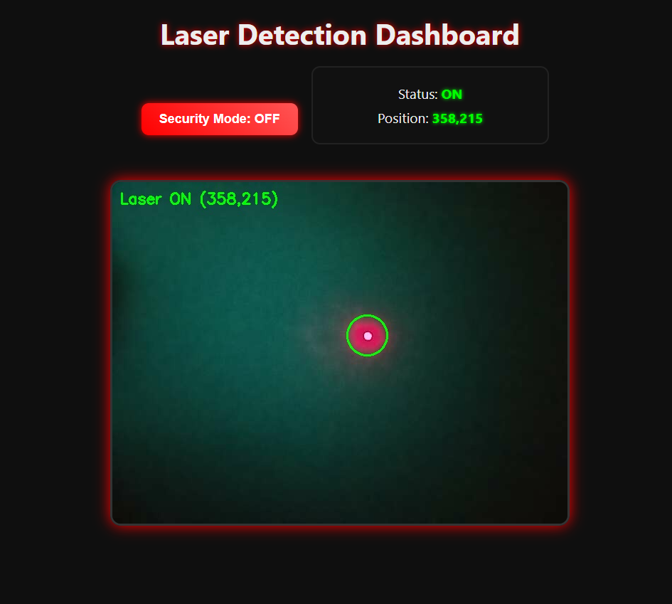
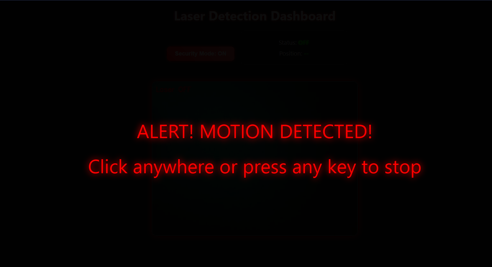

# Laser Detection App

A lightweight, sensor-free Laser Detection & Monitoring System built using **Python**, **Flask**, and **OpenCV**. This project creates a simple, effective security or monitoring system without requiring any Arduino, Raspberry Pi, or additional sensors.

---

## Table of Contents
1. [Overview](#overview)
2. [Features](#features)
3. [Minimal Setup](#minimal-setup)
4. [Installation & Setup](#installation--setup)
5. [Project Structure](#project-structure)
6. [Usage](#usage)
7. [Screenshots](#screenshots)
8. [Coding Documentation](#coding-documentation)
9. [License](#license)

---

## Overview

This project leverages a **camera** and a **laser pointer** to detect interruptions in a laser beam. The system works purely in software:

- A laser is aimed at a fixed point on a wall or board.
- A camera captures the laser dot in real-time.
- OpenCV detects the presence or absence of the laser dot.
- A Flask dashboard shows live camera feed, status, and dot position.
- Security mode triggers an **alarm** immediately when the laser is interrupted.

The system is highly flexible and can cover large areas using **mirrors** to redirect the laser.

---

## Features

- Real-time laser detection without extra sensors.
- Flask-based web dashboard with:
  - Live video feed.
  - Laser status (`ON` / `OFF`) and position.
  - Security mode to trigger alarm on interruption.
- Alarm (`alarm.mp3`) triggers for any laser interruption.
- Minimal latency (adjustable polling interval & threshold).
- Supports multiple monitoring points via mirrors.
- Logs all laser activity to `logs.txt`.

---

## Minimal Setup

This system **does not require any microcontrollers or sensors**. Minimal hardware needed:

1. **Laser pointer** – Aim it at a clean, visible surface.
2. **Camera** – Place so that the laser dot is visible in its frame.
3. **Optional mirrors** – Increase coverage area by reflecting the laser beam.

Setup is as simple as:

- Put the laser in the region you want to secure.
- Place the camera so it captures the laser dot.
- Adjust mirrors to cover additional areas if needed.
- Run the Flask app, open the dashboard, and activate security mode.

No Arduino, Raspberry Pi, or external sensors are required.

---

## Installation & Setup

1. Clone the repository:

    ```bash
    git clone https://github.com/DevLord-Avijit/LDR
    cd LDR
    ```

2. Install dependencies:

    ```bash
    pip install -r requirements.txt
    ```

3. Configure camera & laser detection settings in `config.py`:

    - `CAMERA_INDEX` – camera port (default `0`)
    - `FRAME_WIDTH`, `FRAME_HEIGHT` – capture resolution
    - `RED_LOWER`, `RED_UPPER` – laser color range
    - `DETECTION_RADIUS` – dot detection radius

4. Start the Flask app:

    ```bash
    python app.py
    ```

5. Access dashboard:

    ```
    http://<your-ip>:5000
    ```

Activate **Security Mode** to trigger alarms on any laser interruption.

---

## Project Structure

```
LDR/
│
├── app.py                        # main Flask app entrypoint
├── camera_thread.py              # handles camera capture + OpenCV detection
├── detection_utils.py            # helper functions for color filtering, centroid calc, etc.
├── config.py                     # all tunable settings (radius, color range, camera index, etc.)
│
├── static/                       # CSS, JS, images for Flask
│   ├── css/
│   │   └── style.css
│   ├── js/
│   │   └── dashboard.js
│   └── alarm.mp3
│
├── templates/                    # Flask HTML templates
│   ├── index.html                # main dashboard (shows status, feed, stats)
│   └── settings.html             # optional config UI
│
├── data/
│   └── logs.txt                  # detection logs (timestamped)
│
└── requirements.txt              # dependencies
```

---

## Usage

1. Run the app:

    ```bash
    python app.py
    ```

2. Open the browser and go to:

    ```
    http://<your-ip>:5000
    ```

3. Dashboard features:

- Live camera feed.
- Laser status: `ON` (detected) / `OFF` (interrupted).
- Laser dot position displayed in coordinates.
- Security Mode button:
  - When ON, any laser interruption triggers `alarm.mp3`.
  - Alarm modal pops up; click anywhere or press any key to stop alarm.
- Logs are recorded automatically in `data/logs.txt`.

---

## Screenshots

**Monitor Tab:**



**Alarm Triggered:**



> Screenshots illustrate the laser dot detection and alarm modal on security breach.

---

## Coding Documentation

### `camera_thread.py`

- Handles continuous camera capture in a separate thread.
- Uses `detect_laser_dot()` from `detection_utils.py` to find the laser dot.
- Updates `status` (`ON`/`OFF`) and `position`.
- Provides `get_frame()` for Flask video streaming.

### `detection_utils.py`

- Color filtering, centroid calculation, and radius detection.
- Returns laser dot coordinates if detected.

### `config.py`

- Camera index and frame dimensions.
- Color ranges for detection.
- Dot detection radius.

### `app.py`

- Flask app serving:
  - `/` → dashboard.
  - `/video_feed` → live JPEG stream.
  - `/api/laser_status` → JSON laser status for frontend.
- Integrates `CameraThread` for continuous detection.

### Frontend (JS)

- Polls `/api/laser_status` every 50–100ms.
- Handles security mode and triggers `alarm.mp3`.
- Alarm modal stops on click or key press.
- Display updates in real-time.

---

## License

MIT License 

---

> This project demonstrates a **minimal, software-based LDR (Laser Detection & Response) system** without additional hardware, perfect for DIY security or monitoring experiments.


